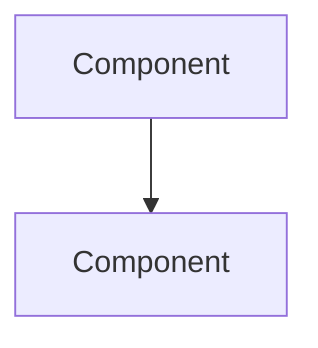

# Documentation

## Purpose

Documentation for Seven Fortunas infrastructure, architecture, compliance, and development practices.

## Contents

### Architecture & Design
- `readme-templates.md` - Templates for creating READMEs
- `soc2-control-mapping.md` - SOC 2 Trust Service Criteria mapping
- `github-app-setup.md` - GitHub App authentication guide

### Compliance
- [SOC 2 Control Mapping](soc2-control-mapping.md) - Control-by-control mapping
- [GitHub App Setup](github-app-setup.md) - Secure automation setup

### Development
- [README Templates](readme-templates.md) - Documentation templates

## Documentation Standards

### README Files

Every directory must have a README.md following these principles:
- **Purpose:** Why this directory exists
- **Contents:** What's inside
- **Usage:** How to use it
- **Navigation:** Links to subdirectories and related docs

See: [readme-templates.md](readme-templates.md) for templates.

### Architecture Decision Records (ADRs)

Significant architectural decisions are documented in `docs/adrs/` (to be created).

Format:
```
ADR-NNN: Decision Title
- Status: Proposed/Accepted/Deprecated
- Context: Problem description
- Decision: What was decided
- Consequences: Pros/cons/trade-offs
```

### Diagrams

Use Mermaid for simple diagrams (renders in GitHub):


For complex diagrams, use dedicated tools (Draw.io, Lucidchart).

## Documentation Workflow

1. **Create:** Write documentation alongside code
2. **Review:** Peer review for accuracy
3. **Update:** Keep documentation current with code changes
4. **Archive:** Move outdated docs to archive/ (not delete)

## Documentation Types

### User Documentation
- Getting started guides
- Usage examples
- Troubleshooting

### Developer Documentation
- Architecture overviews
- API references
- Development setup

### Operations Documentation
- Deployment procedures
- Runbooks
- Incident response

### Compliance Documentation
- Control mappings
- Evidence collection
- Audit procedures

---

**Owner:** Seven Fortunas Documentation Team
**Status:** Phase 1 Complete
**Related:** [README Templates](readme-templates.md) | [SOC 2 Mapping](soc2-control-mapping.md)
