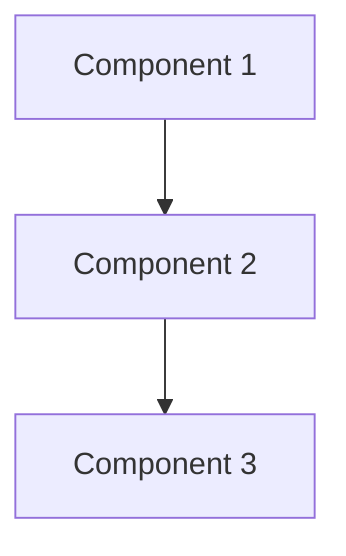
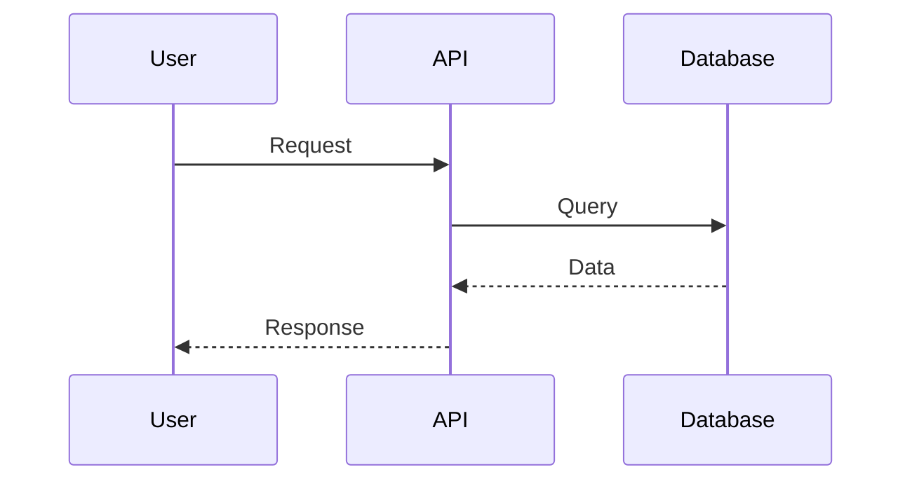
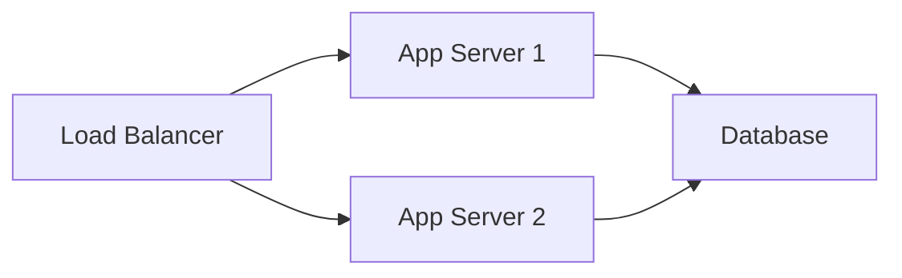

# README Templates

Templates for creating self-documenting architecture.

---

## Root README Template

```markdown
# [Project Name]

[One-sentence description of what this project does]

## Overview

[2-3 paragraphs describing the project's purpose, goals, and high-level architecture]

## Quick Start

\`\`\`bash
# Clone repository
git clone https://github.com/Seven-Fortunas-Internal/[repo-name]

# Install dependencies
[installation commands]

# Run
[run commands]
\`\`\`

## Project Structure

\`\`\`
[repo-name]/
├── docs/                  # Documentation
├── src/                   # Source code
├── scripts/               # Automation scripts
├── tests/                 # Test files
└── README.md              # This file
\`\`\`

## Documentation

- [Architecture](docs/architecture.md) - System design and patterns
- [Development Guide](docs/development.md) - How to contribute
- [API Reference](docs/api.md) - API documentation
- [Deployment](docs/deployment.md) - Deployment procedures

## Navigation

- **Scripts:** [scripts/README.md](scripts/README.md)
- **Source Code:** [src/README.md](src/README.md)
- **Documentation:** [docs/README.md](docs/README.md)

## Prerequisites

- [List of required software/tools]
- [Required permissions/access]
- [Environment configuration]

## Contributing

See [CONTRIBUTING.md](CONTRIBUTING.md) for development guidelines.

## License

[License information]

---

**Owner:** [Team/Person]
**Status:** [Development/Production]
**Last Updated:** [YYYY-MM-DD]
```

---

## Directory README Template

```markdown
# [Directory Name]

## Purpose

[1-2 sentences explaining what this directory contains and why it exists]

## Contents

[Brief description of each file/subdirectory]

### Files

- `file1.py` - [Description]
- `file2.py` - [Description]

### Subdirectories

- `subdir1/` - [Description] ([link](subdir1/README.md))
- `subdir2/` - [Description] ([link](subdir2/README.md))

## Usage

[Examples of how to use files in this directory]

\`\`\`bash
# Example command
./script.sh
\`\`\`

## Dependencies

[List of dependencies specific to this directory]

---

**Owner:** [Team/Person]
**Related:** [Links to related directories]
```

---

## Code Module README Template

```markdown
# [Module Name]

## Overview

[Brief description of what this module does]

## Installation

\`\`\`bash
# Install dependencies
pip install -r requirements.txt
# or
npm install
\`\`\`

## Usage

### Basic Example

\`\`\`python
from module import ClassName

# Example usage
instance = ClassName()
result = instance.method()
\`\`\`

### Advanced Example

\`\`\`python
# More complex usage
\`\`\`

## API Reference

### `ClassName`

**Description:** [What this class does]

**Methods:**
- `method1(param1, param2)` - [Description]
- `method2()` - [Description]

### `function_name`

**Description:** [What this function does]

**Parameters:**
- `param1` (type) - [Description]
- `param2` (type) - [Description]

**Returns:** [Return type and description]

## Configuration

[Environment variables, config files, etc.]

## Testing

\`\`\`bash
# Run tests
pytest tests/
\`\`\`

## Troubleshooting

### Common Issue 1

**Problem:** [Description]
**Solution:** [How to fix]

### Common Issue 2

**Problem:** [Description]
**Solution:** [How to fix]

---

**Owner:** [Team/Person]
**Dependencies:** [List of dependencies]
```

---

## Architecture README Template

```markdown
# Architecture: [System Name]

## Overview

[High-level description of the system architecture]

## Design Principles

1. **[Principle 1]** - [Explanation]
2. **[Principle 2]** - [Explanation]
3. **[Principle 3]** - [Explanation]

## System Components

### Component 1: [Name]

**Purpose:** [What this component does]
**Technology:** [Languages/frameworks used]
**Location:** [Directory or repository]



### Component 2: [Name]

[Similar structure]

## Data Flow



## Architecture Decision Records (ADRs)

- [ADR-001: Decision Title](adrs/001-decision.md) - [Date]
- [ADR-002: Decision Title](adrs/002-decision.md) - [Date]

## Design Patterns

- **[Pattern Name]:** [Where and why it's used]
- **[Pattern Name]:** [Where and why it's used]

## Deployment Architecture

[Description of how the system is deployed]



## Security Considerations

- [Security pattern 1]
- [Security pattern 2]
- [Security pattern 3]

## Performance Considerations

- [Performance optimization 1]
- [Performance optimization 2]

## Scalability

[How the system scales]

## Future Enhancements

- [Planned improvement 1]
- [Planned improvement 2]

---

**Author:** [Name]
**Date:** [YYYY-MM-DD]
**Status:** [Draft/Approved]
**Reviewers:** [Names]
```

---

## ADR (Architecture Decision Record) Template

```markdown
# ADR-XXX: [Decision Title]

## Status

[Proposed | Accepted | Deprecated | Superseded by ADR-XXX]

## Context

[Describe the problem or situation that requires a decision]

## Decision

[Describe the decision that was made]

## Consequences

### Positive

- [Benefit 1]
- [Benefit 2]

### Negative

- [Trade-off 1]
- [Trade-off 2]

### Neutral

- [Consideration 1]
- [Consideration 2]

## Alternatives Considered

### Alternative 1

**Pros:**
- [Pro 1]

**Cons:**
- [Con 1]

**Decision:** [Why not chosen]

### Alternative 2

[Similar structure]

## Implementation Notes

[Technical details about implementation]

## References

- [Link to related documentation]
- [Link to discussion thread]

---

**Author:** [Name]
**Date:** [YYYY-MM-DD]
**Reviewers:** [Names]
```

---

## Empty Directory README Template

```markdown
# [Directory Name]

## Purpose

[Why this directory exists]

## Status

This directory is currently empty. It will contain:
- [Future content 1]
- [Future content 2]

## Planned Structure

\`\`\`
[directory]/
├── [planned-file-1]
├── [planned-file-2]
└── README.md
\`\`\`

---

**Owner:** [Team/Person]
**ETA:** [When content will be added]
```

---

## Usage Guidelines

### When to Use Each Template

1. **Root README:** Every repository root
2. **Directory README:** Every directory (including empty)
3. **Code Module README:** Source code directories with multiple files
4. **Architecture README:** `docs/architecture/` or architecture-focused repos
5. **ADR:** `docs/adrs/` for significant architectural decisions
6. **Empty Directory:** Placeholder directories

### Customization

- Replace `[placeholders]` with actual content
- Remove sections that don't apply
- Add sections specific to your context
- Keep language concise and scannable

### Link Conventions

- Use relative links within repository: `[link](../path/to/file.md)`
- Use absolute URLs for external resources
- Always include link text: `[Documentation](link)` not just `(link)`

### Mermaid Diagrams

- Use Mermaid for simple diagrams (renders in GitHub)
- Use dedicated tools for complex diagrams
- Always include alt text description

---

**Version:** 1.0
**Last Updated:** 2026-02-18
**Owner:** Seven Fortunas Documentation Team
