# Seven Fortunas Markdown Best Practices

**Purpose:** Standards for creating clear, maintainable, AI-accessible markdown documentation

**Audience:** All team members creating documentation, Second Brain content, ADRs, or technical specs

**Core Principle:** Markdown is our universal medium—optimized for humans reading on GitHub/Obsidian AND AI agents loading context efficiently.

---

## Quick Reference

| Aspect | Standard | Rationale |
|--------|----------|-----------|
| **File Size** | Varies by type: ADRs <150, READMEs <120, Guides <1,500, Specs <2,000 | Purpose-driven limits, not arbitrary |
| **BMAD Steps** | <250 lines (strict) | AI execution in focused context |
| **Heading Depth** | Max 3-4 levels (# ## ### ####) | Prevents cognitive overload, clear hierarchy |
| **Line Length** | 80-120 characters (soft limit) | Readable in terminals, side-by-side diffs |
| **Frontmatter** | Required for all Second Brain docs | Enables AI filtering, progressive disclosure |
| **Images** | PNG/JPG, <500KB, `/assets/` directory | Fast loading, version control friendly |
| **Diagrams** | Mermaid (preferred) or ASCII art | Renders in GitHub, editable as text |

---

## File Organization

### File Naming

**Pattern:** `kebab-case-descriptive-name.md`

✅ **Good:**
- `architecture-decision-record-001.md`
- `brand-system-guidelines.md`
- `onboarding-engineering-team.md`

❌ **Bad:**
- `ADR_001.md` (snake_case)
- `My Document.md` (spaces, title case)
- `doc1.md` (non-descriptive)

**Special Files:**
- `README.md` - Directory orientation (required at every level)
- `index.md` - Document collection index
- `CLAUDE.md` - AI agent instructions (project root only)

### Directory Structure

**Seven Fortunas Standard: 3-Level Hierarchy**

```
second-brain/
├── README.md                    # Level 1: Overview
├── architecture/                # Level 2: Domain
│   ├── README.md
│   ├── ADR-001-git-submodule.md  # Level 3: Detail
│   └── system-design.md
├── brand-system/
│   ├── README.md
│   ├── brand.json
│   └── tone-of-voice.md
└── assets/                      # Media files (images, diagrams)
    └── architecture/
        └── system-diagram.png
```

**Rules:**
- **Never exceed 3 levels** - Prevents folder maze
- **README.md at every level** - Orients humans, indexes content for AI
- **Assets in dedicated folder** - Keeps markdown directories clean

---

## File Size Standards

### Size Limits by Document Type

| Document Type | Recommended | Maximum | Rationale |
|---------------|-------------|---------|-----------|
| **BMAD Workflow Steps** | <200 lines | 250 lines | Focused, executable by AI in single pass |
| **ADRs** | <100 lines | 150 lines | Decision record, not essay |
| **READMEs** | <80 lines | 120 lines | Orientation, not documentation |
| **How-To Guides** | 200-400 lines | 800 lines | Task-focused, step-by-step |
| **API/Reference Docs** | 400-800 lines | 1,500 lines | Comprehensive but structured |
| **Specifications** | 800-1,200 lines | 2,000 lines | Complete spec for system/feature |
| **Best Practices Guides** | 1,000-1,500 lines | No hard limit | Comprehensive reference (like this doc!) |

**Key principle:** Document length should match its purpose, not arbitrary limits.

### When Size Matters (Critical Limits)

**BMAD Workflow Step Files (<250 lines - STRICT):**
- **Why:** AI agents execute these in focused context
- **Source:** Validated by BMAD workflow validation system
- **If exceeded:** Extract patterns to data files, split into substeps
- **Example:** `step-03-validate.md` should be concise and action-oriented

**READMEs (<120 lines - STRICT):**
- **Why:** Quick orientation, not documentation
- **Purpose:** "What is this? Where do I go next?"
- **If exceeded:** Move details to dedicated docs, link from README

**ADRs (<150 lines - STRICT):**
- **Why:** Decision record, not design document
- **Purpose:** Context → Decision → Rationale → Consequences
- **If exceeded:** Link to separate design doc or tech spec

### When Size Doesn't Matter (Flexible Limits)

**Comprehensive Guides (like this document):**
- **Current example:** This guide is 1,143 lines - and that's appropriate!
- **Why flexible:** Single authoritative reference is better than scattered docs
- **Guidelines:**
  - Use clear heading hierarchy for navigation
  - Include table of contents for >500 lines
  - Structure with ## sections for logical chunks
  - Split only if document covers multiple distinct topics

**Technical Specifications:**
- **Example:** API reference with 50+ endpoints might be 1,500 lines
- **Why flexible:** Completeness matters more than brevity
- **Guidelines:**
  - Use consistent structure (same format for each endpoint)
  - Consider splitting if covering multiple APIs
  - Use tables for structured data (reduces line count vs prose)

**User Manuals / Documentation:**
- **Example:** Onboarding guide covering 10+ topics
- **Why flexible:** Step-by-step walkthroughs need space
- **Guidelines:**
  - Split by major sections if >2,000 lines
  - Use progressive disclosure (basic → advanced)
  - Include "Quick Start" section for impatient readers

### Diagrams & Images: Line Count Impact

**Key Principle:** Diagrams are worth more than equivalent prose - adjust line counting accordingly.

**Diagram Line Counting Guidelines:**

| Content Type | Line Count Method | Rationale |
|--------------|-------------------|-----------|
| **Prose/Text** | Count every line | Standard counting |
| **Mermaid Diagrams** | Count as 25% of actual lines | 40-line diagram = 10 "effective lines" |
| **Embedded Images** | Count as 5 lines each | Single-line markdown = significant content value |
| **ASCII Art** | Count as 50% of actual lines | More compact than Mermaid, less than prose |
| **Code Examples** | Count every line | Actual code, not illustration |

**Example Calculation:**

```markdown
Document with:
- 150 lines of prose = 150 lines
- 1 Mermaid diagram (60 lines) = 15 effective lines (60 × 0.25)
- 3 embedded images = 15 lines (3 × 5)
- 1 ASCII diagram (20 lines) = 10 effective lines (20 × 0.5)

Total actual lines: 233
Total effective lines: 190 (within 200-line recommendation!)
```

**Why adjust for diagrams?**
- ✅ Diagrams communicate complex concepts faster than prose
- ✅ One architecture diagram > 100 lines of text description
- ✅ Encourages visual communication (better comprehension)
- ✅ Prevents penalizing good documentation practices

### Diagram Complexity Guidelines

**Mermaid Diagram Size Standards:**

| Diagram Type | Recommended | Maximum | When to Split |
|--------------|-------------|---------|---------------|
| **Flowchart** | 5-10 nodes | 20 nodes | Split into sub-processes |
| **Sequence Diagram** | 4-6 actors | 10 actors | Split by interaction phase |
| **Architecture Diagram** | 5-8 components | 15 components | Split by subsystem |
| **State Machine** | 5-8 states | 12 states | Split by major state groups |

**Complexity Red Flags:**

❌ **Too Complex:**
- More than 20 nodes/components
- Crossing lines everywhere (hard to follow)
- Tiny text to fit everything
- Takes >30 seconds to understand

✅ **Right-Sized:**
- Clear visual hierarchy
- Logical grouping of related elements
- Readable at normal zoom level
- Core concept understood in 10-15 seconds

**When diagram is too complex:**
1. **Split into multiple diagrams** (overview → detailed views)
2. **Create diagram hierarchy** (system → subsystem → component)
3. **Use layers** (infrastructure → application → data)

### When to Split Documents

**Split if:**
- ✅ Document covers **multiple distinct topics** (e.g., "API Guide" → split into "Auth API" + "Data API")
- ✅ Document has **multiple audiences** (e.g., "Developer Guide" → "Setup Guide" + "Advanced Patterns")
- ✅ Sections are **rarely read together** (e.g., "System Design" + "Troubleshooting" → separate docs)
- ✅ Exceeds **2,000 effective lines** (counting diagrams at reduced rate)

**Don't split if:**
- ❌ Content is **highly interconnected** (splitting creates broken context)
- ❌ Document is **authoritative reference** (scattered docs harder to maintain)
- ❌ Splitting creates **excessive navigation** (clicking through 10 files to understand one concept)
- ❌ Under **2,000 effective lines** and well-structured (heading hierarchy solves navigation)

---

## Document Structure

### YAML Frontmatter (Required for Second Brain)

**Purpose:** Machine-readable metadata for AI context filtering and progressive disclosure

```yaml
---
context-level: overview | domain | detail
relevant-for: [skill-names, roles, or domains]
last-updated: YYYY-MM-DD
author: Name or "AI + Human"
status: draft | active | archived
tags: [optional, keywords]
---
```

**Example (Architecture ADR):**
```yaml
---
context-level: detail
relevant-for: [architecture, engineering, code-review]
last-updated: 2026-02-14
author: Jorge + Claude
status: active
tags: [git, dependencies, bmad]
---

# ADR-001: Use Git Submodule for BMAD Library

[Content follows...]
```

**AI Agent Usage:**
```bash
# Agent query: "Load architecture context"
# Returns: All docs with relevant-for: [architecture]

# Agent query: "Load overview-level content"
# Returns: All docs with context-level: overview
```

### Heading Hierarchy

**Standard: 3-4 Levels (Depends on Document Type)**

**Short Documents (ADRs, READMEs, How-Tos): Max 3 Levels**
```markdown
# Document Title (H1) - Used once per document

## Major Section (H2) - Core structure

### Subsection (H3) - Details
```

**Comprehensive Guides & Specifications: Max 4 Levels**
```markdown
# Document Title (H1) - Used once per document

## Major Section (H2) - Core structure

### Subsection (H3) - Topic details

#### Sub-detail (H4) - Specific examples or edge cases
```

**Avoid H5/H6:** If you need 5+ heading levels, split into multiple documents

**Example Structure:**
```markdown
# Product Requirements Document

## Executive Summary
Brief overview...

## User Personas

### Henry (CEO)
Details...

### Patrick (CTO)
Details...

## Functional Requirements

### FR-1: GitHub Organization
Requirements...
```

### Content Patterns

**1. README Pattern (Directory Orientation)**

```markdown
# Directory Name

**Purpose:** One-sentence explanation

**Contents:**
- file1.md - Description
- file2.md - Description

**Quick Start:** First thing to do

**Related:** [Link to related directories]
```

**2. ADR Pattern (Architecture Decision)**

```markdown
# ADR-NNN: Title (50 chars max)

## Context
What situation prompted this decision?

## Decision
What we decided to do (concise, 1-2 sentences)

## Rationale
- Bullet point 1
- Bullet point 2
- Bullet point 3

## Consequences
- Positive: What this enables
- Negative: What this constrains
- Neutral: What this changes
```

**3. Guide Pattern (How-To Documentation)**

```markdown
# How to [Achieve Goal]

**Time:** X minutes
**Prerequisites:** What you need before starting

## Steps

### 1. First Step
Instructions...

```bash
# Example command
command --flag value
```

### 2. Second Step
Instructions...

## Troubleshooting

**Issue:** Problem description
**Solution:** How to fix it
```

**4. Reference Pattern (API/Config Documentation)**

```markdown
# Component Name Reference

## Overview
Brief description

## Parameters

| Parameter | Type | Required | Description |
|-----------|------|----------|-------------|
| name | string | Yes | Component name |
| options | object | No | Configuration options |

## Examples

```yaml
# Minimal example
name: "example"
```

```yaml
# Full example with all options
name: "example"
options:
  debug: true
  timeout: 30
```
```

---

## Content Formatting

### Typography

**Emphasis:**
- **Bold** (`**text**`) - Key terms, important concepts, warnings
- *Italic* (`*text*`) - Subtle emphasis, foreign terms, variable names
- `Code` (`` `text` ``) - Technical terms, file paths, commands, values

**Lists:**
```markdown
**Unordered (bullets):**
- Feature lists
- Options
- Benefits

**Ordered (numbers):**
1. Sequential steps
2. Priority rankings
3. Process flows

**Nested (max 2 levels):**
- Parent item
  - Child item
  - Child item
- Parent item
```

**Checkboxes (tasks):**
```markdown
- [ ] Incomplete task
- [x] Completed task
- [ ] Task with subtasks:
  - [x] Subtask 1
  - [ ] Subtask 2
```

### Code Blocks

**Always specify language for syntax highlighting:**

```markdown
```bash
# Bash commands
git clone repo_url
cd project
```

```python
# Python code
def example():
    return "Hello"
```

```yaml
# YAML configuration
name: "Seven Fortunas"
type: "organization"
```

```json
{
  "name": "Seven Fortunas",
  "type": "organization"
}
```
```

**Inline code:**
- Use for: variable names, file paths, small code snippets
- Example: "Edit the `config.yaml` file in `/path/to/directory`"

### Tables

**Standard format:**
```markdown
| Column 1 | Column 2 | Column 3 |
|----------|----------|----------|
| Data     | Data     | Data     |
| Data     | Data     | Data     |
```

**Alignment:**
```markdown
| Left-aligned | Center-aligned | Right-aligned |
|:-------------|:--------------:|--------------:|
| Text         | Text           | 100           |
| Text         | Text           | 200           |
```

**When to use tables:**
- ✅ Structured data with 3-6 columns
- ✅ Comparison matrices
- ✅ Configuration parameters
- ❌ Long prose (use lists instead)
- ❌ Complex nested data (use YAML/JSON code blocks)

### Links

**Internal links (within repository):**
```markdown
[Link text](../path/to/file.md)
[Link to section](file.md#section-name)
```

**External links:**
```markdown
[Link text](https://example.com)
```

**Reference-style links (for repeated URLs):**
```markdown
See [GitHub][gh] and [Seven Fortunas][7f] for details.

[gh]: https://github.com
[7f]: https://sevenfortunas.com
```

---

## Images & Diagrams

### Image Standards

**Formats:**
- **PNG** - Screenshots, UI mockups, logos (transparency support)
- **JPG** - Photos, complex images (smaller file size)
- **SVG** - Icons, simple diagrams (scalable, text-based)

**Size Limits:**
- **Target:** <200KB per image
- **Maximum:** 500KB per image
- **Reason:** Git performance, fast page loading

**Storage:**
```
project-root/
└── assets/
    ├── architecture/
    │   └── system-diagram.png
    ├── brand/
    │   └── logo.png
    └── screenshots/
        └── dashboard-mockup.png
```

**Markdown syntax:**
```markdown


**Caption:** Additional context about the image
```

**Best practices:**
- Always include descriptive alt text (accessibility + AI context)
- Use relative paths (portability across environments)
- Compress images before committing (tools: TinyPNG, ImageOptim)
- Name files descriptively: `auth-flow-diagram.png` not `image1.png`

### Diagram Standards

**Preferred: Mermaid (Text-Based Diagrams)**

**Why Mermaid?**
- ✅ Renders directly in GitHub, Obsidian, VS Code
- ✅ Version controlled as text (clear diffs)
- ✅ Easy to update (edit text, not image)
- ✅ AI-readable (structured text format)
- ✅ Counts as 25% of actual lines (encourages visual docs)

**Flowchart example:**
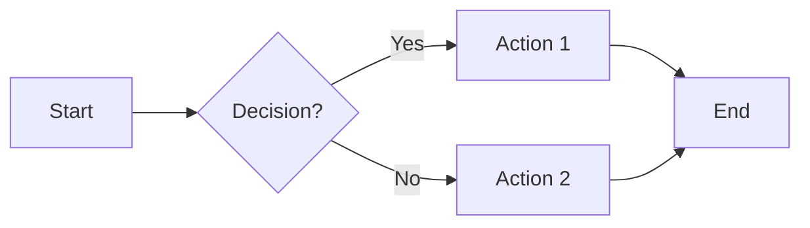

**Sequence diagram example:**
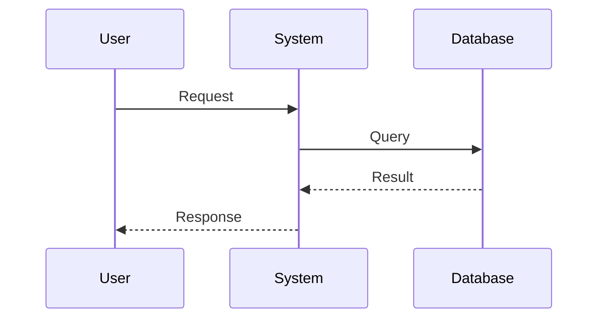

**Architecture diagram example:**
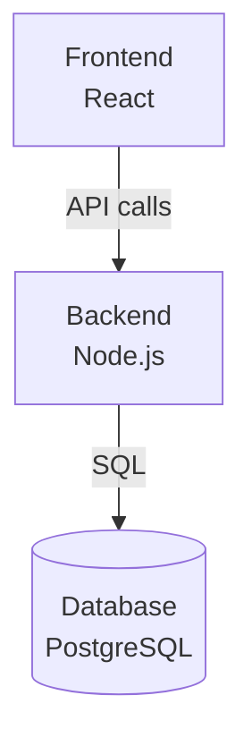

**Class diagram example (for data models):**
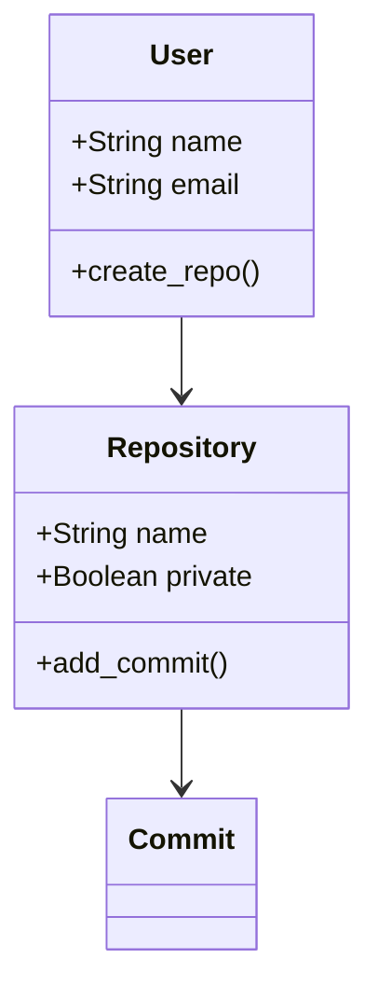

**Entity-relationship diagram (for database schemas):**
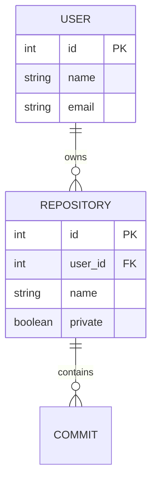

**State diagram (for workflows/status):**
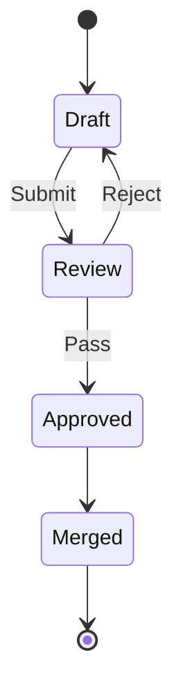

### Diagram Format Selection Guide

**When to use Mermaid:**
- ✅ **Flowcharts** - Process flows, decision trees (up to 20 nodes)
- ✅ **Sequence diagrams** - API interactions, system communications (up to 10 actors)
- ✅ **Architecture diagrams** - System components (up to 15 components)
- ✅ **State machines** - Workflow states, status transitions (up to 12 states)
- ✅ **Class/ER diagrams** - Data models, database schemas (up to 10 entities)
- ✅ **Any diagram** that needs frequent updates (text = easy changes)

**When to use image-based tools (draw.io, Figma, Lucidchart):**
- ✅ **Complex architecture** (>15 components, multiple layers)
- ✅ **UI wireframes/mockups** (visual design detail matters)
- ✅ **Network topology** (physical layout, complex connections)
- ✅ **Custom illustrations** (branded diagrams, marketing materials)
- ✅ **Detailed technical diagrams** (circuit boards, infrastructure maps)

**Export guidelines for image-based diagrams:**
- **Format:** PNG (screenshots, UI) or SVG (scalable diagrams)
- **Resolution:** 2x resolution for clarity (e.g., 1600px wide for 800px display)
- **File size:** <500KB (compress with TinyPNG if needed)
- **Include source:** Commit `.drawio` or `.fig` file alongside PNG for editability

**When to use ASCII art:**
- ✅ **Very simple diagrams** (3-5 boxes, linear flow)
- ✅ **Terminal/CLI documentation** (renders everywhere, including plain text)
- ✅ **Quick sketches** (faster than Mermaid for trivial diagrams)
- ❌ **Complex relationships** (ASCII art becomes unreadable)

**ASCII art example (simple flow):**
```
┌─────────────┐
│   Browser   │
└──────┬──────┘
       │ HTTPS
       ▼
┌─────────────┐
│   API       │
└──────┬──────┘
       │ SQL
       ▼
┌─────────────┐
│  Database   │
└─────────────┘
```

### Diagram Quality Standards

**✅ Good Diagram Characteristics:**

1. **Clear Purpose**
   - Communicates one concept clearly
   - Has descriptive title
   - Includes legend if using colors/symbols

2. **Appropriate Complexity**
   - 5-15 elements (not 3, not 30)
   - Logical grouping of related components
   - Clear visual hierarchy

3. **Readable**
   - Text large enough at normal zoom
   - High contrast (works in light/dark mode)
   - No crossing lines (or minimized)

4. **Self-Contained**
   - Understands without reading entire document
   - Includes labels for all elements
   - Context provided in caption

5. **Accessible**
   - Descriptive alt text for images
   - Color not sole means of conveying information
   - Text contrast meets WCAG standards

**❌ Diagram Anti-Patterns:**

1. **Diagram Overload**
   - ❌ 10 diagrams in 200-line doc (too many)
   - ✅ 2-3 strategic diagrams showing key concepts

2. **Tiny Text**
   - ❌ 20+ components crammed in one diagram
   - ✅ Split into overview + detailed views

3. **Unnecessary Diagrams**
   - ❌ Diagram showing linear 3-step process (use list instead)
   - ✅ Diagram showing branching logic or parallel flows

4. **Outdated Diagrams**
   - ❌ Diagram contradicts code/spec (worse than no diagram)
   - ✅ Update diagrams when system changes (text-based helps!)

5. **No Context**
   - ❌ Diagram with no title, labels, or caption
   - ✅ Clear title, labeled components, explanatory caption

### Example: Good vs Bad Diagrams

**❌ BAD - Too Complex (25+ nodes, unreadable):**
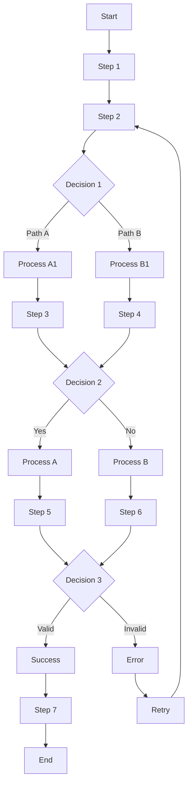
**Problem:** Too many paths, can't follow logic, should split into sub-processes

**✅ GOOD - Right-Sized (8 nodes, clear flow):**
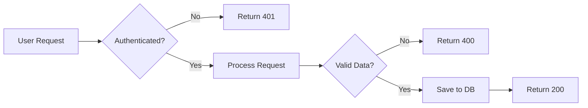
**Why good:** Clear flow, easy to follow, shows key decision points

---

**❌ BAD - Diagram for Simple List:**
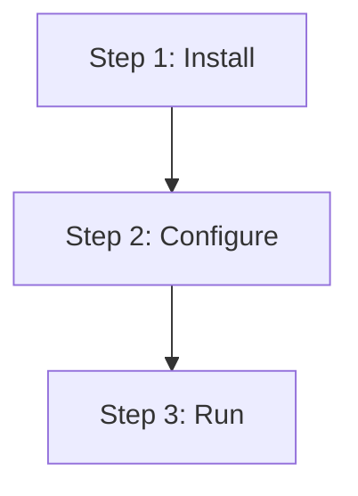
**Problem:** This is just a linear list, markdown list is clearer

**✅ GOOD - Use List Instead:**
```markdown
## Setup Steps

1. Install dependencies: `npm install`
2. Configure environment: `cp .env.example .env`
3. Run server: `npm start`
```
**Why good:** Simpler, more readable, easier to update

---

**❌ BAD - No Context:**
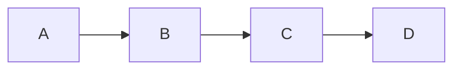
**Problem:** No labels, no title, no explanation - useless

**✅ GOOD - With Context:**
```markdown
### Authentication Flow

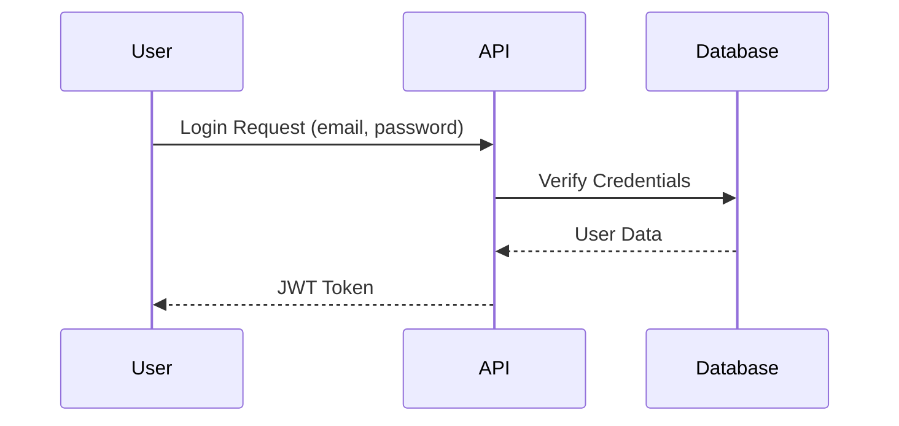

**Caption:** User authenticates with email/password, receives JWT token valid for 24 hours.
```
**Why good:** Title, labeled components, explanatory caption

---

## Special Sections

### Admonitions (Callouts)

**GitHub-compatible format:**

```markdown
> **Note:** Informational callout for additional context

> **Warning:** Caution about potential issues

> **Important:** Critical information that must not be missed

> **Tip:** Helpful suggestion or best practice
```

**Rendered as:**
> **Note:** This is an informational callout

> **Warning:** This requires caution

### Collapsible Sections (Optional)

**For long content that shouldn't clutter main view:**

```markdown
<details>
<summary>Click to expand: Advanced Configuration</summary>

Detailed content here...

```yaml
advanced:
  option: value
```

</details>
```

### Horizontal Rules

**Use sparingly to separate major sections:**
```markdown
---
```

**When to use:**
- Between major document sections
- Before appendices or references
- After frontmatter before content

**When NOT to use:**
- Between every heading (creates visual noise)
- Within lists or tables

---

## Writing Style

### Voice & Tone

**Active voice:**
- ✅ "The system validates input before processing"
- ❌ "Input is validated before processing is done"

**Imperative for instructions:**
- ✅ "Run the command to start the server"
- ❌ "The command should be run to start the server"

**Concise:**
- ✅ "Configure security settings"
- ❌ "You will need to configure the security settings for your application"

### Accessibility

**Alt text for images:**
```markdown

```

**Descriptive link text:**
- ✅ [GitHub authentication documentation](https://docs.github.com/auth)
- ❌ [Click here](https://docs.github.com/auth)

**Heading hierarchy:**
- Never skip heading levels (no H1 → H3 without H2)
- Use semantic HTML when needed (`<details>`, `<summary>`)

---

## Templates

### 1. README.md Template

```markdown
# [Directory or Project Name]

**Purpose:** [One-sentence description]

**Contents:**
- `file1.md` - [Description]
- `file2.md` - [Description]

**Quick Start:**
1. [First step]
2. [Second step]

**Related:**
- [Link to related directory or documentation]

---

*Last updated: YYYY-MM-DD*
```

### 2. ADR Template

```markdown
---
context-level: detail
relevant-for: [architecture, engineering]
last-updated: YYYY-MM-DD
author: Name + Claude
status: active
---

# ADR-NNN: [Decision Title]

## Context

[What situation prompted this decision? What problem are we solving?]

## Decision

[What we decided to do - be concise and specific]

## Rationale

- [Key reason 1]
- [Key reason 2]
- [Key reason 3]

## Consequences

**Positive:**
- [What this enables]

**Negative:**
- [What this constrains]

**Neutral:**
- [What this changes]

---

*Supersedes: ADR-XXX (if applicable)*
*Superseded by: (leave blank until superseded)*
```

### 3. How-To Guide Template

```markdown
---
context-level: domain
relevant-for: [topic, role]
last-updated: YYYY-MM-DD
author: Name
status: active
---

# How to [Achieve Goal]

**Time:** X minutes
**Prerequisites:**
- [Prerequisite 1]
- [Prerequisite 2]

## Overview

[Brief explanation of what this guide covers]

## Steps

### 1. [First Step Name]

[Explanation]

```bash
# Example command
command --flag value
```

**Expected result:** [What should happen]

### 2. [Second Step Name]

[Continue...]

## Verification

[How to confirm it worked]

## Troubleshooting

### Issue: [Problem Description]

**Symptoms:** [What you see when this happens]
**Solution:** [How to fix it]

---

**Need help?** [Link to support or related documentation]
```

### 4. Technical Spec Template

```markdown
---
context-level: detail
relevant-for: [component, system]
last-updated: YYYY-MM-DD
author: Name + Claude
status: draft | active | deprecated
---

# [Component Name] Specification

## Overview

[Brief description of component purpose]

## Architecture

```mermaid
[Diagram showing component relationships]
```

## API / Interface

### Method: `methodName()`

**Parameters:**

| Parameter | Type | Required | Description |
|-----------|------|----------|-------------|
| param1 | string | Yes | [Description] |
| param2 | number | No | [Description] |

**Returns:** [Return type and description]

**Example:**

```python
result = methodName(param1="value")
```

## Configuration

```yaml
# Configuration example
component:
  option1: value1
  option2: value2
```

## Error Handling

| Error Code | Meaning | Resolution |
|------------|---------|------------|
| ERR_001 | [Description] | [How to fix] |

## Testing

[Testing approach and requirements]

---

**References:**
- [Related ADR-XXX](../architecture/ADR-XXX.md)
- [Related component](../component-name.md)
```

---

## AI-Friendly Patterns

### Progressive Disclosure for AI Agents

**Three-level context loading:**

```yaml
# Level 1: Overview (always loaded)
context-level: overview
---
Brief document providing high-level orientation

# Level 2: Domain (loaded when relevant)
context-level: domain
relevant-for: [brand, content, marketing]
---
Category-level content for specific domains

# Level 3: Detail (loaded on-demand)
context-level: detail
relevant-for: [architecture, ADR-001]
---
Detailed specifications, only loaded when explicitly needed
```

### Structured Data Over Prose

**For AI comprehension, prefer:**

✅ **Tables:**
```markdown
| Setting | Value | Purpose |
|---------|-------|---------|
| timeout | 30s | Connection timeout |
```

✅ **YAML blocks:**
```yaml
settings:
  timeout: 30s
  retries: 3
```

✅ **Bulleted lists:**
- Requirement 1
- Requirement 2

❌ **Dense paragraphs:**
"The system should have a timeout of 30 seconds and retry 3 times when connections fail..."

### Clear References

**AI agents need unambiguous links:**

✅ **Good:**
```markdown
See [Architecture Decision ADR-001](../architecture/ADR-001-git-submodule.md)
```

❌ **Bad:**
```markdown
See the architecture document mentioned above.
```

---

## Practical: Calculating Effective Line Count

**How to determine if your document is within size guidelines when it includes diagrams:**

### Example 1: Architecture Document

```
Content Breakdown:
- Introduction & Overview: 80 lines (prose)
- Mermaid architecture diagram: 60 lines (code)
- Component descriptions: 120 lines (prose)
- Mermaid sequence diagram: 40 lines (code)
- 3 embedded screenshots: 3 lines (markdown)
- Deployment section: 80 lines (prose)
- ASCII network diagram: 24 lines (art)

Calculation:
- Prose: 280 lines × 1.0 = 280 effective lines
- Mermaid diagrams: 100 lines × 0.25 = 25 effective lines
- Images: 3 × 5 = 15 effective lines
- ASCII art: 24 lines × 0.5 = 12 effective lines

Total actual lines: 407 lines
Total effective lines: 332 effective lines

Guideline: Specifications <2,000 lines
Status: ✅ Well within limits (16% of max)
```

### Example 2: API Reference Document

```
Content Breakdown:
- Overview: 40 lines (prose)
- Authentication section: 80 lines (prose + code examples)
- 15 endpoint descriptions: 600 lines (prose + code)
- 2 Mermaid flow diagrams: 80 lines (code)
- Error handling: 100 lines (prose + table)
- Rate limiting: 60 lines (prose)

Calculation:
- Prose/code/tables: 880 lines × 1.0 = 880 effective lines
- Mermaid diagrams: 80 lines × 0.25 = 20 effective lines

Total actual lines: 960 lines
Total effective lines: 900 effective lines

Guideline: API/Reference docs <1,500 lines
Status: ✅ Within limits (60% of max)
```

### Example 3: How-To Guide

```
Content Breakdown:
- Prerequisites: 30 lines (prose + list)
- Step-by-step instructions: 200 lines (prose + code)
- 1 Mermaid flowchart (workflow): 45 lines (code)
- Troubleshooting: 60 lines (prose)
- 2 screenshot images: 2 lines (markdown)

Calculation:
- Prose/code: 290 lines × 1.0 = 290 effective lines
- Mermaid diagram: 45 lines × 0.25 = 11 effective lines
- Images: 2 × 5 = 10 effective lines

Total actual lines: 337 lines
Total effective lines: 311 effective lines

Guideline: How-To guides <800 lines
Status: ✅ Comfortably within limits (39% of max)
```

### Example 4: When to Split

```
Content Breakdown:
- Executive summary: 100 lines
- System architecture: 400 lines + 200 lines Mermaid
- Data models: 300 lines + 150 lines Mermaid
- API specifications: 600 lines + 100 lines Mermaid
- Deployment guide: 400 lines + 80 lines Mermaid
- Monitoring: 200 lines + 60 lines Mermaid

Calculation:
- Prose/code: 2,000 lines × 1.0 = 2,000 effective lines
- Mermaid diagrams: 590 lines × 0.25 = 148 effective lines

Total actual lines: 2,590 lines
Total effective lines: 2,148 effective lines

Guideline: Specifications <2,000 effective lines
Status: ⚠️ Slightly over limit (107% of max)

Recommendation: Split into 3 documents:
1. system-architecture.md (architecture + data models) ~800 effective lines
2. api-specifications.md (API specs) ~650 effective lines
3. deployment-monitoring.md (deployment + monitoring) ~700 effective lines
```

### Quick Decision Tree

```
Is your document over the guideline?
│
├─ NO → ✅ You're good! Commit it.
│
└─ YES → Calculate effective line count (diagrams at reduced rate)
         │
         ├─ Under effective limit? → ✅ You're good! Document it in PR.
         │
         └─ Still over? → Consider:
              • Can diagrams be simplified? (split complex diagrams)
              • Can content be split logically? (by topic, audience)
              • Is this an authoritative reference? (may warrant exception)
              • Document reasoning in PR for review
```

### Documenting Effective Line Count

**When submitting PR with diagram-heavy docs, include in description:**

```markdown
## Document Size Justification

**Actual lines:** 890 lines
**Effective lines:** 645 lines

**Breakdown:**
- Prose/code: 700 lines (×1.0 = 700)
- Mermaid diagrams (3): 180 lines (×0.25 = 45)
- Images (4): counted as 20 effective lines

**Guideline:** <800 lines for How-To guides
**Status:** ✅ Within limits (81% of effective guideline)

**Rationale:** Architecture diagrams essential for understanding
deployment process. Splitting would break context.
```

---

## Validation Checklist

Before committing markdown documentation:

### Structure
- [ ] Frontmatter present (if Second Brain content)
- [ ] File size <250 lines (or split/extracted)
- [ ] Heading hierarchy logical (no skipped levels)
- [ ] README.md present at directory level

### Content
- [ ] Code blocks have language specified
- [ ] Images <500KB, in `/assets/` directory
- [ ] Links tested (no broken internal links)
- [ ] Alt text provided for all images

### Quality
- [ ] Spelling/grammar checked
- [ ] Active voice, imperative for instructions
- [ ] Concise (no unnecessary words)
- [ ] Tables formatted properly
- [ ] Mermaid diagrams render correctly

### AI-Friendliness
- [ ] `relevant-for` tags accurate
- [ ] `context-level` appropriate
- [ ] Clear section headings (AI can parse)
- [ ] Structured data over prose where appropriate

---

## Tools & Resources

### Recommended Markdown Editors

- **VS Code** - Markdown preview, linting, Mermaid support
- **Obsidian** - Graph view, YAML frontmatter, local-first
- **Typora** - WYSIWYG markdown editor
- **GitHub Web Editor** - Quick edits directly in browser

### Linting & Validation

```bash
# Markdown linting (checks formatting, structure)
npm install -g markdownlint-cli
markdownlint *.md

# Link checking (finds broken links)
npm install -g markdown-link-check
markdown-link-check README.md
```

### Image Optimization

- **TinyPNG** - Compress PNG/JPG without quality loss
- **ImageOptim** (Mac) - Batch image compression
- **SVGO** - Optimize SVG files

### Diagram Tools

- **Mermaid Live Editor** - https://mermaid.live (preview/export)
- **Draw.io** - Desktop diagramming (export to PNG)
- **Excalidraw** - Sketch-style diagrams

---

## Examples from Seven Fortunas

### Example 1: Good Architecture Document

```markdown
---
context-level: domain
relevant-for: [architecture, engineering]
last-updated: 2026-02-14
author: Jorge + Claude
status: active
---

# System Architecture Overview

## Components

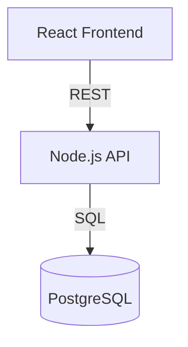

## Technology Stack

| Layer | Technology | Rationale |
|-------|-----------|-----------|
| Frontend | React 18 | [ADR-003](ADR-003.md) |
| Backend | Node.js 20 | [ADR-004](ADR-004.md) |
| Database | PostgreSQL 15 | [ADR-001](ADR-001.md) |

## Related Documents

- [ADR-001: Database Choice](ADR-001.md)
- [Deployment Guide](../deployment/guide.md)

---

*For questions, see [#engineering](https://7f.slack.com/channels/engineering)*
```

**Why this is good:**
- ✅ Clear frontmatter
- ✅ Mermaid diagram (text-based)
- ✅ Table for structured data
- ✅ Links to related ADRs
- ✅ Under 50 lines (focused scope)

### Example 2: Good README

```markdown
# Architecture

**Purpose:** Architecture decisions, system design, and technical specifications

**Contents:**
- `ADR-001-git-submodule.md` - BMAD library integration approach
- `ADR-002-github-structure.md` - Two-org GitHub model
- `system-design.md` - High-level system architecture
- `tech-stack.md` - Technology choices and rationale

**Quick Start:**
1. Read `system-design.md` for architecture overview
2. Review ADRs for key technical decisions
3. See [deployment guide](../deployment/) for operational details

**Related:**
- [Best Practices](../best-practices/) - Coding standards
- [Security](../security/) - Security architecture

---

*Last updated: 2026-02-14*
```

**Why this is good:**
- ✅ One-sentence purpose
- ✅ File descriptions (orient new readers)
- ✅ Quick start (immediate value)
- ✅ Related links (context discovery)
- ✅ Under 30 lines

---

## Appendix: Common Mistakes

### Mistake 1: Walls of Text

❌ **Bad:**
```markdown
The Seven Fortunas infrastructure uses a two-organization model on GitHub where the public organization contains open-source tools and demos while the internal organization contains proprietary code and configurations and this approach allows us to maintain clear separation between public and private content while enabling collaboration and the public org serves as our developer relations platform showcasing our AI-native approach...
```

✅ **Good:**
```markdown
## GitHub Organization Structure

Seven Fortunas uses a **two-organization model**:

**Public Org (`Seven-Fortunas`):**
- Open-source tools and demos
- Developer relations showcase
- AI-native approach examples

**Internal Org (`Seven-Fortunas-Internal`):**
- Proprietary code and configurations
- Team collaboration workspace
- Production infrastructure

**Rationale:** Clear public/private separation while enabling collaboration.

See [ADR-002](ADR-002-github-structure.md) for full decision rationale.
```

### Mistake 2: Overly Deep Nesting

❌ **Bad:**
```markdown
# Title
## Section
### Subsection
#### Sub-subsection
##### Sub-sub-subsection
###### Sub-sub-sub-subsection
```

✅ **Good:**
```markdown
# Title

## Section 1
Content about section 1

### Important Detail
Specific detail about section 1

## Section 2
If you need more depth, split into separate documents
```

### Mistake 3: Unclear Links

❌ **Bad:**
```markdown
See [this](../file.md) and [here](https://example.com) for more info.
```

✅ **Good:**
```markdown
See [Architecture Decision ADR-001](../architecture/ADR-001.md) and [GitHub API Documentation](https://docs.github.com/api) for implementation details.
```

### Mistake 4: Missing Context

❌ **Bad:**
```markdown
# Script

```bash
./run.sh --flag --other-flag value
```
```

✅ **Good:**
```markdown
# Deployment Script

**Purpose:** Deploy infrastructure to production environment

**Prerequisites:**
- AWS credentials configured (`aws configure`)
- Docker installed and running
- Access to `Seven-Fortunas-Internal` GitHub org

**Usage:**

```bash
# Deploy to staging
./scripts/deploy.sh --env staging --region us-east-1

# Deploy to production (requires approval)
./scripts/deploy.sh --env production --region us-east-1
```

**Verification:**

Check deployment status at: https://dashboard.sevenfortunas.com/deployments
```

---

## Summary: Seven Fortunas Markdown Philosophy

**Markdown is our universal medium** - it must work for:
- ✅ **Humans** reading on GitHub, Obsidian, VS Code
- ✅ **AI agents** loading context for BMAD skills
- ✅ **Version control** showing clear diffs over time
- ✅ **Future team** onboarding in days, not weeks

**Three core principles:**
1. **Progressive disclosure** - 3-level hierarchy (Overview → Domain → Detail)
2. **Dual-audience design** - YAML frontmatter + markdown body
3. **Focused files** - <200 lines recommended, split when exceeding 250

**When in doubt:**
- Keep it simple
- Keep it short
- Keep it structured
- Keep it accessible

---

## Deployment to GitHub Organization

**This guide should be shared organization-wide:**

### Recommended Location

```
seven-fortunas-brain/
└── standards/
    ├── README.md                           # Standards overview
    ├── markdown-best-practices.md          # This document
    ├── code-style-guide.md                 # TBD
    └── security-standards.md               # TBD
```

### Sharing Strategy

1. **Copy to `seven-fortunas-brain` repository** (authoritative version)
2. **Link from main README.md** for visibility
3. **Reference in CLAUDE.md** so AI agents follow standards
4. **Onboarding checklist** includes reading this guide
5. **PR templates** link to relevant sections (e.g., "See markdown-best-practices.md#adrs")

### Keeping Current

- **Owner:** Sally (UX Designer) + Jorge (maintainer)
- **Updates:** Via pull request to `seven-fortunas-brain`
- **Review cycle:** Quarterly or as needed
- **Feedback:** GitHub Issues or [#documentation](https://7f.slack.com/channels/documentation)

---

**Questions or suggestions?** Update this document via pull request or discuss in [#documentation](https://7f.slack.com/channels/documentation)

**Version:** 1.0
**Last Updated:** 2026-02-14
**Owner:** Sally (UX Designer) with Jorge
